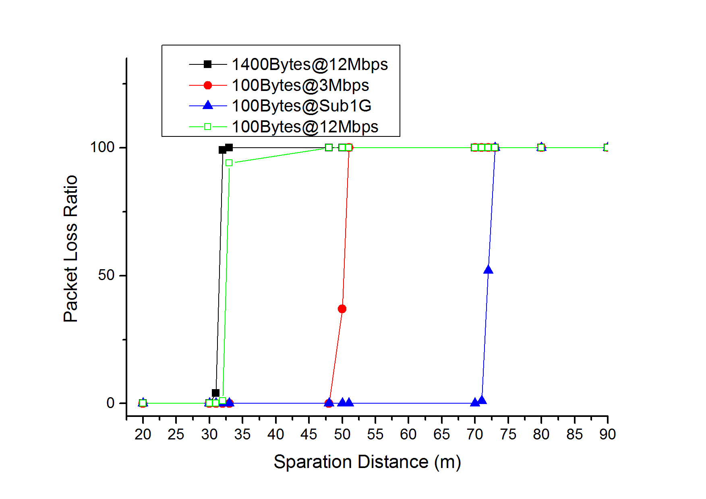

# map_based_relay
## MBR in Linux: [Linux](Linux)
 Based on Linux kernel version 3.18
### Usage (MBR-S case):
 1. Patch [relaying_patch](Linux/20170306-0001-map-based-relay-encapsulate-the-relay-mac-addr-into-.patch) for the kernel and build.
 1. Set the radio into OCB mode (802.11p mode).
 1. Build and insmod MBR module.
 1. Install digital map and maintain neighbor list as shown in [test_readme](Linux/test/README.md)
 1. Manually open the relaying function:
 ```
 echo 1 > /sys/kernel/debug/mbr/mbr_start
 ```
 
## MBR in NS-3: [NS3](NS-3)
### About GeoSVR
 1. Source code comes from https://github.com/gnehzuil/GeoSVR
 1. We transplant the source code from ns-2 to ns-3. 
### About the obstacle shadowing model (OBM)
 Source code comes from S. E. Carpenter and M. L. Sichitiu, ¡°An obstacle model implementation for evaluating radio shadowing with ns-3,¡± in Proc. WNS3, 2015, pp.17¨C24.
#### Dependency of the obstacle shadowing model
```
sudo apt-get install libcgal-dev
sudo cp NS3/wave/model/proj/64bit/lib/libproj.so /usr/lib
```

#### Basic performace of channels in ns-3 when OBM is implemented
 1. \alpha = 9 dB and \beta = 0.4 dB/m.
 1. Two nodes, scenario as shown in the following figure:
 
 1. Performance as shown in the following figure:
 
